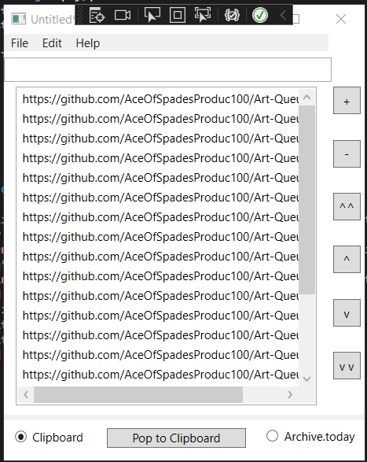

**NOTICE**
-------------

**Replaced with a single-script Python version at https://github.com/AceOfSpadesProduc100/Art-queue-maker-Python**

# Art Queue Maker
 Manage links to artwork to share with other people and groups (Discord, Telegram, etc), and also bulk send links to archive.today

# To do
Fix freezes and allow UI elements to correctly resize

# Requirements
* .NET 7 or higher
* Windows 7 or later, or the latest stable version of WINE if on Linux.
